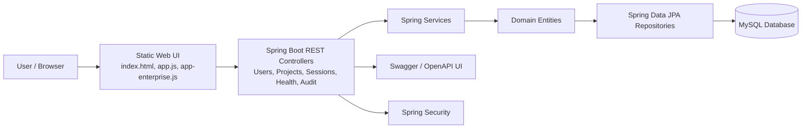

# Enterprise Software Lifecycle and DevOps Management System

A full-stack web application for managing enterprise software projects across the software lifecycle, including users, projects, repositories, audit records, and software process operations. The project is implemented as a Spring Boot REST API with a static JavaScript frontend and a MySQL-backed database.

## Project Overview

The Enterprise Software Lifecycle and DevOps Management System is designed to provide a simple platform for tracking software development work across the lifecycle. It exposes APIs for management of users, projects, repositories, test cases, and audit events while providing a web UI for enterprise operation teams.

The system supports user role-based access, security constraints, and API documentation through OpenAPI/Swagger.

## Business Goals

- Centralize enterprise software lifecycle records.
- Manage projects, repository metadata, and engineering users.
- Track software delivery activity through audit events.
- Support project organization and DevOps operational visibility.
- Provide a web interface and REST APIs for frontend and backend workflow integration.

## Technology Stack

| Layer | Technology |
| --- | --- |
| Backend | Java 17, Spring Boot 3.1.2 |
| REST API | Spring Web, Spring Data JPA |
| Security | Spring Security |
| API Documentation | Springdoc OpenAPI Swagger UI |
| Database | MySQL |
| Frontend | Static HTML, CSS, JavaScript |
| Build Tool | Maven |

## System Architecture

The application has three key layers:

1. Presentation layer: static files under `src/main/resources/static` render the web UI.
2. Application/API layer: controllers and services expose REST APIs and business logic.
3. Persistence layer: entities and repositories connect to the MySQL database.

The main Spring Boot process starts from `NeuroforgeBackendApplication` and uses `SecurityConfig` for access control and auth.

## Main Project Structure

```text
src/
  main/
    java/com/neuroforge/neuroforge_backend/
      config/               Security and Spring configuration
      controller/           REST controllers
      entity/               JPA entities
      repository/           Data access repositories
      service/              Business services
    resources/
      application.yaml      Spring configuration and datasource settings
      data.sql              SQL seed data
      static/               Frontend UI assets
```

The repository also contains the Maven build file `pom.xml`, the VS Code workspace configuration, and Java build outputs in `target/`.

## Domain Model

The entities represent the main domain objects:

- `User`: stores user identity, role, email, and user record data.
- `Project`: stores enterprise project definition and metadata.
- `Repository`: stores code repository metadata.
- `TestCase`: stores software test and validation cases.
- `AuditEvent`: stores audit trail and operational history.

## API Flow

The project exposes REST controllers under the `/api` namespace:

- `/api/projects` for project management
- `/api/users` for user management
- `/api/session` for the active authenticated session details
- `/api/health` for health checks

The `AuditEventController` and related service manage audit logging activities for the enterprise lifecycle workflow.

## Security Model

The application uses Spring Security with HTTP Basic authentication and role-based access rules. The `SecurityConfig` class:

- allows access to static assets and Swagger/OpenAPI docs
- protects all `/api/**` endpoints behind authentication
- supports roles such as `ADMIN`, `DEVELOPER`, and user role normalization

## Database Configuration

The application is configured in `application.yaml` with a MySQL datasource:

```yaml
spring:
  datasource:
    url: jdbc:mysql://localhost:3306/neuroforge_db
    username: ${DB_USERNAME:root}
    password: ${DB_PASSWORD:Password}
```

The database schema and seed data are initialized automatically through JPA and `data.sql`.

## How to Run the Project

### Prerequisites

- Java 17+
- Maven
- MySQL server
- Git

### 1. Clone the repository

```bash
git clone https://github.com/01-anupkr/Entreprise-Software-Lifecycle-and-DevOps-Management-System.git
cd Entreprise-Software-Lifecycle-and-DevOps-Management-System
```

### 2. Prepare MySQL

Create a database named `neuroforge_db` and make sure the MySQL server is running locally.

```sql
CREATE DATABASE neuroforge_db;
```

### 3. Configure environment variables

Set the DB username and password if needed:

```bash
export DB_USERNAME=root
export DB_PASSWORD=Password
```

### 4. Build the project

```bash
mvn clean package
```

### 5. Run the Spring Boot server

```bash
mvn spring-boot:run
```

The app starts from the main Spring Boot class and serves the frontend static assets from `src/main/resources/static`.

### 6. Access the application

Open the UI at:

```text
http://localhost:8080
```

Swagger/OpenAPI UI is available at:

```text
http://localhost:8080/swagger-ui/index.html
```

## Project at a Glance

```text
+-------------------------------+
| Enterprise Software Lifecycle |
| and DevOps Management System |
+-------------------------------+
| Users  Projects  Repositories |
| Test Cases  Audit Events      |
| Role-Based Security           |
| REST + Swagger API            |
+-------------------------------+
```

## Architecture Diagram



## Development and Process Flow

The normal development lifecycle for this project is:

1. Create or update a user, project, repository, or test case through the API or frontend.
2. Store the required metadata in the database.
3. Run application services and controllers to expose or update the resource.
4. Record audit events for operational traceability.
5. Validate through the UI, API endpoints, and Swagger documentation.

## Repository Workflow

This repository follows a Git-based workflow:

```bash
git status
git add .
git commit -m "Your meaningful commit message"
git push origin main
```

## Contribution Guidelines

- Keep controller, service, entity, repository, and configuration responsibilities separated.
- Follow Spring Boot and Java package conventions.
- Avoid committing generated build artifacts unless needed for classroom or demonstration purposes.
- Document API or process changes in the README and code comments.

## Example Resource Endpoints

```text
GET /api/health
GET /api/session
GET /api/projects
POST /api/projects
GET /api/users
POST /api/users
```

## Use Cases

This project is suitable for demonstration of:

- lifecycle process management
- DevOps workflow visibility
- project repository management
- role-based access management
- audit trail collection
- Java Spring Boot enterprise backend structure

## License

This project is distributed with an open repository structure and is ready for extension or demonstration use.
